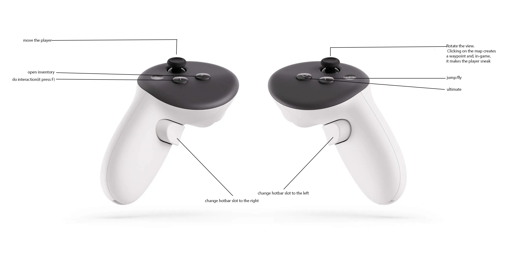

# HytaleVRInjector-mod

Experimental Windows x64 VR injector/dashboard for Hytale.

This repository contains the native dashboard, the injected VR camera hook, the UI scaling hook, SteamVR action manifests, tests, and the minimal third-party sources/binaries required to rebuild the project.

## Status

This is an experimental mod. It is not affiliated with or endorsed by Hytale, Hypixel Studios, Valve, OpenVR, or MinHook.

## Repository Layout

- `src/` - dashboard, VR hook, probes, shared headers, and helper tools
- `src/ui_scale_hook/` - OpenGL UI scaling hook built as `HytaleUIScaleHook.dll`
- `tests/` - native math/unit tests
- `third_party/openvr/` - minimal OpenVR headers/import library/runtime DLL
- `third_party/minhook/` - vendored MinHook sources used by the UI hook
- `third_party/nlohmann/` - vendored JSON parser used by the release updater
- `BUILDING.md` - rebuild instructions
- `CHANGELOG.md` - release history and notable changes

## How to Use

1. Start SteamVR and make sure your headset is connected.
2. Launch Hytale and enter a world or join a server.
3. Disable `FXAA` in the Hytale graphics settings.
4. Press `F7` in-game to show the player coordinate block.
5. Start `hytale_camera_dashboard.exe`.
6. In the dashboard, click `Scan player block`.
7. Select the detected coordinate block from the list.
8. Click `Center VR` to inject and align the VR view.

Keep SteamVR running while using the mod. Hytale must stay focused for the mod controls to work correctly.

### VR Hands and Held Items

- The player's avatar hands are rendered at the tracked SteamVR controller poses.
- Hytale items, tools, weapons, blocks, decorations, shields, and torches are detected from the live first-person render and rebuilt from the assets shipped with the game.
- Items remain attached to the correct hand while attacking or placing blocks, including short detection gaps during Hytale's native animations.
- Hand and item scale, position, orientation, and depth tolerance can be adjusted under `Advanced options`.

### VR Image Quality

Supersampling and sharpening are always visible on the dashboard. The other
quality controls are available in `Advanced options`:

- `Supersampling %`: disabled by default. In windowed mode, enabling it asks Hytale to render a larger backbuffer before AFW reconstruction. Fullscreen and maximized windows use safe output scaling instead. Higher values cost substantially more GPU time.
- `Sharpening %`: disabled by default. It restores some local detail after AFW reprojection but adds a small rendering cost and can amplify shimmering.
- `VR FXAA`: enabled by default. It follows the direction of high-contrast edges to reduce diagonal stair-stepping and foliage shimmer. Disable it only if its GPU cost is too high or fine textures look too soft.
- `Stereo projection`: keeps the SteamVR per-eye projection and depth-based AFW disparity enabled. This should normally remain on.

IPD and stereo separation remain available for headset and comfort tuning. SteamVR controls asynchronous reprojection or motion smoothing externally. Temporal DLSS, FSR 2/3, XeSS, and TAA are not exposed because the injector does not currently receive Hytale's motion vectors and temporal history.

### Video Tutorial

[](https://youtu.be/ktmVUCQHKF0)

## Controls



## Support

If you have a problem with the mod, contact me on Discord: `heurazy`.

## Build

Requirements:

- Windows 10/11
- Visual Studio 2022 with Desktop development with C++
- CMake 3.20 or newer

```powershell
cmake --preset vs2022-x64
cmake --build --preset release
ctest --preset release
cmake --install build --config Release --prefix dist
```

The runnable package is generated in `dist`.

## Debug Logs

Release builds keep verbose logs disabled by default.

```powershell
$env:HYTALEVR_DEBUG_LOGS = "1"
```

Logs are written under `%TEMP%\HytaleVR`.

## License

Project code is licensed under Apache-2.0. Third-party dependencies keep their own licenses in `third_party/`.
